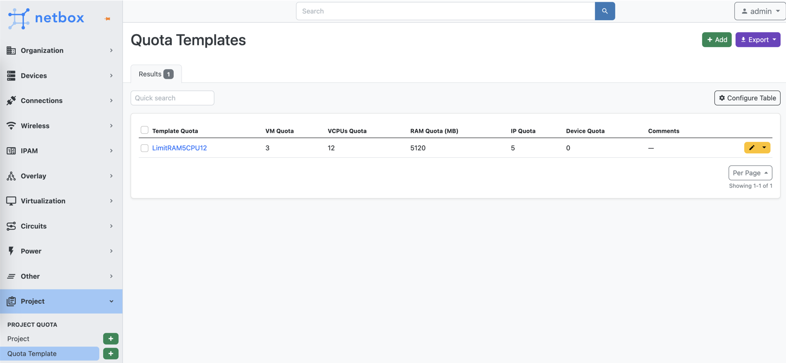
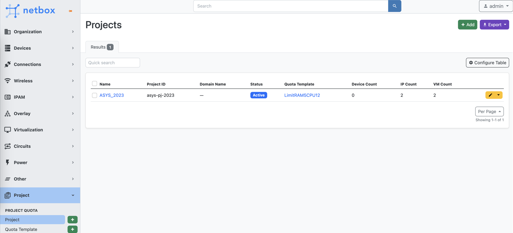
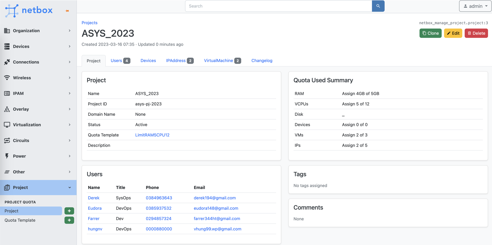

# Netbox Project Quota

## Installing

To install the plugin, first using pip and install netbox-project-quota:

```
cd /opt/netbox
source venv/bin/activate
pip3 install netbox-project-quota
```

Next, enable the plugin in `/opt/netbox/netbox/netbox/configuration.py`, or if you have a `/configuration/plugins.py `file, the plugins.py file will take precedence.

```
PLUGINS = [
    'netbox_project_quota'
]
```

Then you may need to perform the final step of restarting the service to ensure that the changes take effect correctly:

```
python netbox/manage.py migrate netbox_project_quota
sudo systemctl restart netbox
```

## Screenshots







## Cài đặt Plugin trên môi trường docker.

Bước 1: Clone thư mục docker netbox về.

```
git clone -b release https://github.com/netbox-community/netbox-docker.git

cd netbox-docker
```

Bước 2: Tạo file `plugin_requirements.txt`
Tạo file `plugin_requirements.txt` với nội dung

```
gunicorn
netbox-project-quota
```

Bước 3: Tạo file `Dockerfile-Plugins`

Tạo file `Dockerfile-Plugins` để build lại image mới có kèm plugin.

```
FROM netboxcommunity/netbox:latest

COPY plugin_requirements.txt /
RUN /opt/netbox/venv/bin/pip install  --no-warn-script-location -r /plugin_requirements.txt

# These lines are only required if your plugin has its own static files.
COPY configuration/configuration.py /etc/netbox/config/configuration.py
# RUN SECRET_KEY="dummy" /opt/netbox/venv/bin/python /opt/netbox/netbox/manage.py collectstatic --no-input
```

Bước 4: Sửa file `configuration/configuration.py`.

Tìm tới dòng chứa từ PLUGIN trong file `configuration/configuration.py` để sửa.

```
PLUGINS = ['netbox_project_quota']
```

Bước 5: Build lại images có chứa plugin netbox-project-quota

```
docker-compose build --no-cache
```

Bước 6: Tạo file `docker-compose.override.yml`

```
version: '3.4'
services:
  netbox:
    ports:
      - 8000:8080
    build:
      context: .
      dockerfile: Dockerfile-Plugins
    image: netbox:latest-plugins
  netbox-worker:
    image: netbox:latest-plugins
    build:
      context: .
      dockerfile: Dockerfile-Plugins
  netbox-housekeeping:
    image: netbox:latest-plugins
    build:
      context: .
      dockerfile: Dockerfile-Plugins
```

Bước 7: Chạy docker-compose

```
docker-compose up -d
```

Chờ từ 2-3 phút, truy cập vào URL.


Nếu muốn xóa container để chạy lại từ đầu thì thực hiện

```
docker-compose down -v
```
